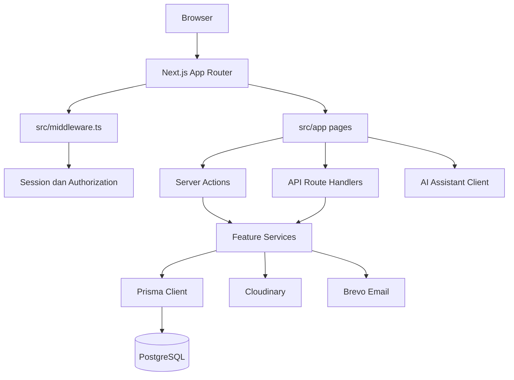

<p align="center">
  
</p>

# Kalivergo

Kalivergo adalah platform manajemen kelas berbasis web untuk mengelola anggota, tugas, keuangan kelas, jadwal, seminar, dan portofolio anggota dalam konteks tenant kelas. Aplikasi juga menyediakan panel platform untuk verifikasi KYC dan pengelolaan aplikasi pembuatan kelas.

Dokumen ini menjelaskan struktur teknis dan penggunaan aplikasi berdasarkan implementasi yang ada di repository.

## Daftar Isi

1. [Latar Belakang](#latar-belakang)
2. [Arsitektur](#arsitektur)
3. [Struktur Folder Utama](#struktur-folder-utama)
4. [Fitur](#fitur)
5. [Cara Kerja](#cara-kerja)
6. [Cara Menjalankan](#cara-menjalankan)
7. [Cara Penggunaan Laman dan Fitur](#cara-penggunaan-laman-dan-fitur)
8. [Keamanan, Kebijakan, dan Privasi](#keamanan-kebijakan-dan-privasi)
9. [Lisensi](#lisensi)
10. [Batasan dan Catatan Pengembangan](#batasan-dan-catatan-pengembangan)

## Latar Belakang

Pengelolaan kelas sering tersebar pada banyak alat: percakapan untuk pengumuman, spreadsheet untuk kas, formulir untuk pendaftaran, dan penyimpanan terpisah untuk dokumen anggota. Kalivergo dirancang untuk menyatukan alur tersebut dalam satu ruang kerja yang dapat digunakan oleh anggota kelas, pengurus kelas, pemilik tenant, dan administrator platform.

Tujuan utama Kalivergo adalah:

- menyediakan identitas digital dan portofolio anggota;
- memusatkan tugas, deadline, penugasan, dan pengumpulan submission;
- mencatat pemasukan, pengeluaran, kategori, pembayaran kas, invoice, serta tunggakan;
- mengelola seminar, pendaftaran, dan jadwal kegiatan;
- menyediakan kontrol akses berbasis tenant dan peran;
- membantu administrator platform melakukan pemeriksaan KYC secara terukur.

## Arsitektur

### Stack teknologi

| Lapisan | Teknologi | Peran |
| --- | --- | --- |
| UI dan routing | Next.js App Router, React 18, TypeScript | Server Components, Client Components, laman, dan route handler |
| Styling | Tailwind CSS, CSS global, ThemeProvider | Tema terang/gelap dan komponen visual |
| Data | PostgreSQL, Prisma 5 | Skema relasional, query, relasi, dan akses database |
| Validasi/form | Zod, React Hook Form | Validasi input dan pengelolaan formulir |
| Auth | Session cookie custom dan NextAuth Credentials | Login anggota serta pemeriksaan identitas/peran |
| Penyimpanan | Cloudinary | Foto profil dan dokumen KYC |
| Email | Brevo API | Verifikasi email dan alur password |
| AI | `src/features/ai-assistant` dan service AI | Widget asisten dan komunikasi ke layanan AI |
| Visualisasi | Recharts, Framer Motion, Three.js | Grafik, animasi, dan elemen visual interaktif |

### Diagram aliran arsitektur



### Pola lapisan

1. `src/app` menentukan URL, layout, rendering laman, dan endpoint API.
2. `src/components` berisi komponen UI yang dapat dipakai ulang.
3. `src/actions` berisi server actions untuk mutasi seperti registrasi, pengelolaan CMS, dan autentikasi.
4. `src/features` mengelompokkan domain bisnis berdasarkan fitur, biasanya dalam bentuk schema, repository, service, dan komponen.
5. `src/server` menangani detail server-only: session, database, tenant context, email, audit, KYC, storage, dan AI.
6. `src/lib` menyediakan helper kompatibilitas dan utilitas umum yang dipakai lintas lapisan.
7. `prisma/schema.prisma` adalah sumber model data dan relasi utama.

### Multi-tenant dan otorisasi

Tenant merepresentasikan kelas. Relasi utamanya adalah `University -> StudyProgram -> Tenant`, sementara pengguna terhubung ke tenant melalui `TenantMembership`. URL tenant menggunakan `customSlug`, misalnya `/{slug}`.

Peran platform adalah `SUPER_ADMIN_KYC` dan `ADMIN_KYC`. Peran tenant adalah `OWNER` dan `MEMBER`. Peran CMS adalah `PRESIDENT`, `VICE_PRESIDENT`, `TREASURER`, `VICE_TREASURER`, dan `SECRETARY`.

`src/middleware.ts` menyelesaikan tenant dari segment pertama URL, menyimpan konteks pada cookie `kalivergo_tenant`, lalu memeriksa akses sebelum request mencapai laman. Pemeriksaan lebih lanjut dilakukan oleh helper seperti `requireTenantMembership`, `requireTenantRole`, `requireTenantCmsAccess`, `requirePlatformAdmin`, dan `requireSuperAdminKyc`.

### Model data inti

- `User`: identitas, kredensial, status KYC admin, dan data portofolio.
- `University`, `StudyProgram`, `Tenant`: hierarki organisasi dan kelas.
- `TenantMembership`: keanggotaan pengguna pada tenant beserta role.
- `OwnerApplication`, `MemberApplication`, `KycReview`: pendaftaran owner/anggota dan review KYC.
- `Task`, `Submission`: tugas dan pengumpulan pekerjaan.
- `Transaction`, `Category`, `CashPayment`, `UangKasSchedule`: modul keuangan.
- `Seminar`, `SeminarSubmission`, `Schedule`: kegiatan dan pendaftaran.
- `CmsAccessPermission`: izin modul CMS per role dan tenant.
- `AuditLog`: jejak aktivitas administratif.

## Struktur Folder Utama

| Folder | Fungsi |
| --- | --- |
| `prisma/` | Skema PostgreSQL/Prisma dan seed data development. |
| `public/` | Aset statis seperti logo dan favicon. |
| `src/app/` | Entry point Next.js App Router: laman publik, tenant, platform, auth, legal, dan API. |
| `src/app/[slug]/` | Area tenant berdasarkan `customSlug`, termasuk home, dashboard, profil, portofolio, project, seminar, dan CMS. |
| `src/app/api/` | Route handler HTTP untuk auth, finance, member, seminar, task, portofolio, upload, access, dan AI assistant. |
| `src/actions/` | Server actions autentikasi, registrasi, CMS, KYC, dan operasi mutasi lainnya. |
| `src/components/` | Komponen presentasional dan layout untuk landing, home, dashboard, CMS, platform, security, serta UI umum. |
| `src/features/` | Modul domain terisolasi: auth, tenant, owner, member, CMS, finance, task, seminar, portfolio, project, KYC, platform, dan AI assistant. |
| `src/server/` | Implementasi server-only untuk session, Prisma, tenant context, audit, email, storage, KYC, dan AI. |
| `src/lib/` | Helper lintas modul, termasuk database, auth, tenant, email, Cloudinary, audit, dan utilitas. |
| `src/shared/` | Kontrak dan helper bersama, terutama authorization dan komponen/utilitas shared. |
| `src/config/` | Pembacaan serta validasi konfigurasi environment. |
| `src/data/` | Data statis yang digunakan aplikasi, seperti data anggota organisasi. |
| `src/stores/` | State client, termasuk tema melalui Zustand. |
| `src/styles/` | CSS global dan tema. |
| `src/types/` | Tipe TypeScript bersama dan deklarasi SDK. |
| `tests/` | Setup, contract tests, security tests, dan unit tests. |

## Fitur

### Fitur pengguna dan kelas

- Registrasi owner kelas dengan universitas, program studi, nama kelas, slug, selfie, dan dokumen pendukung.
- Registrasi anggota ke kelas dengan foto profil dan KTM, lalu menunggu persetujuan.
- Login, logout, verifikasi email, lupa password, dan reset password.
- Pemilihan konteks kelas ketika pengguna memiliki lebih dari satu membership.
- Profil serta portofolio publik anggota dengan bio, pengalaman, keahlian, tautan sosial, dan website.

### Fitur operasional tenant

- Dashboard ringkasan jumlah tugas, saldo, seminar, dan anggota.
- Manajemen tugas, deadline, penugasan anggota, dan submission.
- Manajemen seminar, pendaftaran/submission, dan informasi lokasi/waktu.
- Jadwal kegiatan kelas.
- Keuangan: pemasukan, pengeluaran, kategori, invoice, pembayaran uang kas, jadwal kas, dan daftar tunggakan.
- CMS people untuk approval anggota dan pengelolaan role.
- CMS access untuk mengatur izin modul berdasarkan role CMS.
- Audit log untuk aktivitas finance, people, tasks, seminar, schedule, access, dan KYC.

### Fitur platform

- Panel admin platform yang terlindungi.
- Review dan approval/rejection aplikasi owner/KYC.
- Audit KYC.
- Pembatasan akses berbeda untuk `ADMIN_KYC` dan `SUPER_ADMIN_KYC`.

### Asisten AI dan tema

- Widget AI tersedia pada root layout dan berkomunikasi dengan endpoint `/api/ai-assistant/chat`.
- Tema terang/gelap disimpan melalui key `kalivergo-theme` dan diterapkan oleh `ThemeProvider`.

## Cara Kerja

### Alur akses tenant

1. Pengguna membuka URL dengan `customSlug` tenant.
2. Middleware mencari tenant aktif di database.
3. Konteks tenant ditulis ke cookie `kalivergo_tenant` selama tujuh hari.
4. Session pengguna dibaca dari cookie `kalivergo_user`.
5. Laman tenant memeriksa membership; laman CMS memeriksa CMS access.
6. Service mengambil data dengan `tenantId`, sehingga data kelas tidak tercampur dengan tenant lain.

### Alur registrasi owner

1. Pengguna mengisi formulir owner dan mengunggah dokumen.
2. Sistem memvalidasi input serta mengirim verifikasi email.
3. Setelah email valid, aplikasi owner berstatus menunggu KYC.
4. Admin platform meninjau aplikasi pada panel KYC.
5. Aplikasi yang disetujui membuat atau mengaktifkan tenant dan membership owner.

### Alur anggota

1. Anggota mendaftar dengan target tenant.
2. `MemberApplication` dibuat dengan status `PENDING_APPROVAL`.
3. Pengurus yang memiliki akses CMS memeriksa data dan menyetujui/menolak.
4. Setelah disetujui, anggota dapat mengakses laman tenant sesuai role dan membership.

### Alur mutasi data

Request dari laman atau API masuk ke authorization helper, divalidasi dengan schema, diproses service/repository, kemudian disimpan oleh Prisma. Operasi administratif penting dicatat pada `AuditLog`. File disimpan melalui Cloudinary dan email verifikasi dikirim melalui Brevo.

## Cara Menjalankan

### Prasyarat

- Node.js dan npm.
- PostgreSQL yang dapat diakses oleh aplikasi.
- Kredensial Cloudinary dan Brevo bila fitur upload/email digunakan.
- URL dan secret untuk NextAuth serta layanan AI bila fitur terkait digunakan.

### Instalasi

```bash
npm install
copy .env.example .env
```

Isi `.env` dengan nilai environment yang benar. Jangan memakai secret contoh di production. Setelah database siap, jalankan:

```bash
npx prisma generate
npx prisma db push
npm run dev
```

Server development dijalankan pada `http://localhost:3001` sesuai script `dev`. Pastikan `NEXTAUTH_URL` dan `NEXT_PUBLIC_BASE_URL` disesuaikan dengan port yang benar.

Perintah lain:

```bash
npm run build
npm start
npm run test:security
npx prisma db seed
```

## Cara Penggunaan Laman dan Fitur

| Laman | Penggunaan |
| --- | --- |
| `/` | Landing page platform dan pintu masuk ke login/registrasi. |
| `/login` atau `/auth/login` | Login pengguna dengan kredensial yang tersedia. Setelah berhasil, pengguna diarahkan ke konteks tenant yang dapat diakses. |
| `/signup` | Memulai pendaftaran pengguna/owner. |
| `/member-signup` | Mendaftar sebagai anggota pada tenant tertentu; siapkan foto profil dan KTM untuk proses approval. |
| `/forgot-password` | Meminta tautan atau token pemulihan password melalui email. |
| `/verify-email` dan `/verify-forgot-password` | Menyelesaikan verifikasi email atau reset password menggunakan token yang valid. |
| `/{slug}` | Masuk ke ruang kelas/tenant tertentu; hanya membership yang valid yang dapat melanjutkan. |
| `/{slug}/home` | Melihat beranda dan informasi aktivitas tenant. |
| `/{slug}/dashboard` | Melihat ringkasan operasional, termasuk tugas, keuangan, seminar, dan anggota. |
| `/{slug}/profil` | Mengelola informasi profil pengguna. |
| `/{slug}/portofolio/{username}` | Melihat portofolio publik anggota. Data portofolio diubah melalui fitur profil/portofolio. |
| `/{slug}/project` | Melihat showcase atau informasi project tenant. |
| `/{slug}/seminar` | Melihat seminar dan melakukan submission/pendaftaran bila tersedia. |
| `/{slug}/cms` | Dashboard pengurus dengan ringkasan tugas, saldo, seminar, dan anggota. Memerlukan CMS access. |
| `/{slug}/cms/tasks` | Membuat serta mengelola tugas dan memantau submission. |
| `/{slug}/cms/people` | Menyetujui anggota dan mengatur role anggota/pengurus. |
| `/{slug}/cms/finance` | Mencatat transaksi, kategori, invoice, pembayaran kas, serta melihat saldo/tunggakan. |
| `/{slug}/cms/schedule` | Menambah dan mengelola agenda kegiatan kelas. |
| `/{slug}/cms/seminar` | Mengelola seminar dan submission peserta. |
| `/{slug}/cms/access` | Mengatur hak akses modul CMS per role; umumnya membutuhkan hak owner. |
| `/{slug}/cms/audit` | Meninjau jejak aktivitas administratif tenant. |
| `/platform/login` dan `/platform/register` | Login/registrasi admin platform dengan mekanisme role platform. |
| `/platform` | Overview panel platform. |
| `/platform/kyc` | Meninjau aplikasi owner dan keputusan KYC. |
| `/platform/kyc-audit` | Melihat audit review KYC. |
| `/privacy` | Membaca kebijakan privasi aplikasi. |
| `/terms` | Membaca syarat dan ketentuan penggunaan. |
| `/unauthorized` | Ditampilkan ketika pengguna tidak memiliki akses ke resource. |

Endpoint API utama berada di `/api/auth`, `/api/access`, `/api/ai-assistant/chat`, `/api/finance`, `/api/member`, `/api/seminar`, `/api/tasks`, `/api/portofolio`, `/api/upload-profile`, `/api/verify-email`, dan `/api/verify-forgot-password`. Endpoint tersebut sebaiknya dipanggil melalui UI atau client resmi agar session, validasi, dan konteks tenant tetap berjalan.

## Keamanan, Kebijakan, dan Privasi

### Kontrol keamanan teknis

- Password diproses menggunakan bcrypt/bcryptjs.
- Session memiliki masa berlaku tujuh hari dan disimpan pada cookie aplikasi.
- Middleware menolak route platform, CMS, dan route tenant ketika identitas atau role tidak memenuhi syarat.
- Otorisasi selalu memperhitungkan `tenantId`; membership pada tenant A tidak otomatis memberi akses ke tenant B.
- Validasi input menggunakan Zod pada modul yang relevan.
- Token verifikasi disimpan sebagai hash dan memiliki masa berlaku.
- Operasi administratif dicatat dalam audit log.
- Header `Cache-Control: no-store` diterapkan pada response yang diproteksi.
- Secret, API key, database URL, dan kredensial storage harus disimpan di environment variable.

### Kebijakan privasi aplikasi

Laman `/privacy` menjelaskan data yang dikumpulkan, tujuan penggunaan, berbagi informasi, keamanan, retensi, cookies, layanan pihak ketiga, dan hak pengguna. Data yang terlihat dari model aplikasi meliputi identitas, email/NIM, nomor telepon, alamat, foto, dokumen KTM/KTP, data portofolio, data membership, transaksi, submission, dan token verifikasi.

Pengguna sebaiknya hanya mengunggah dokumen yang diperlukan untuk proses terkait. Operator platform wajib membatasi akses dokumen KYC, menjaga secret deployment, dan menerapkan kebijakan retensi serta penghapusan data sesuai kebutuhan hukum dan operasional. Teks pada laman privasi adalah kebijakan yang ditampilkan aplikasi; peninjauan hukum dan penetapan kontak resmi tetap menjadi tanggung jawab pemilik layanan.

### Syarat penggunaan

Laman `/terms` mengatur penerimaan syarat, keanggotaan, tanggung jawab pengguna, penggunaan yang diperbolehkan, larangan, kekayaan intelektual, batasan tanggung jawab, pengakhiran, perubahan syarat, dan penyelesaian sengketa. Pengguna harus membaca laman tersebut sebelum menggunakan layanan.

## Lisensi

Repository ini memiliki `package.json` dengan flag `private: true`, tetapi tidak ditemukan file `LICENSE` atau deklarasi lisensi kode pada root repository. Karena itu, lisensi open source tidak boleh diasumsikan. Hak cipta dan hak penggunaan kode tetap berada pada pemilik repository sampai pemilik menetapkan lisensi secara eksplisit.

Jika proyek akan didistribusikan atau digunakan pihak ketiga, pemilik perlu menambahkan file `LICENSE` (misalnya lisensi proprietary atau lisensi open source yang dipilih secara sadar) dan memperbarui bagian ini. Lisensi library pihak ketiga tetap mengikuti lisensi masing-masing dependency.

## Batasan dan Catatan Pengembangan

- Seed Prisma ditujukan untuk development; kredensial seed tidak boleh dipakai di production.
- `.env.example` menggunakan contoh port yang perlu diselaraskan dengan script development pada port `3001`.
- Sebagian fitur project dapat menggunakan data contoh/mock sehingga perlu diverifikasi sebelum dianggap sumber data production.
- Ketersediaan email, Cloudinary, database, dan layanan AI bergantung pada konfigurasi environment.
- Sebelum deployment, jalankan build, security test, review environment secret, backup database, dan review hukum atas laman privasi serta syarat penggunaan.
=======
<h1 align="center">Kalivergo</h1>

<p align="center">
  <strong>Workspace digital untuk mengelola organisasi, kelas, dan proyek dalam satu ekosistem.</strong>
</p>

<p align="center">
  <a href="DOCUMENTATION.MD">Dokumentasi</a> ·
  <a href="dataset/platform/privacy.md">Privasi</a> ·
  <a href="dataset/platform/terms.md">Syarat dan Ketentuan</a>
</p>

---

## Tentang Kalivergo

Kalivergo adalah platform manajemen berbasis web untuk membantu organisasi, universitas, program studi, dan kelas bekerja dengan lebih terarah. Platform ini menyatukan informasi, anggota, tugas, jadwal, seminar, portofolio, proyek, keuangan, dan audit dalam satu ruang kerja multi-tenant.

Kalivergo dibangun untuk mengurangi pekerjaan administratif yang terpecah-pecah, memperjelas tanggung jawab, dan membuat setiap aktivitas memiliki konteks yang mudah ditelusuri.

## Filosofi Perusahaan

### Terarah dalam bekerja

Setiap pekerjaan perlu memiliki tujuan, pemilik, tenggat, dan konteks yang jelas. Kalivergo membantu tim bergerak dari rencana menuju eksekusi tanpa kehilangan arah.

### Terhubung dalam satu ekosistem

Informasi, anggota, aktivitas, dan keputusan seharusnya tidak hidup di tempat yang terpisah. Kami merancang pengalaman kerja yang menghubungkan seluruh siklus kegiatan dalam satu platform.

### Tumbuh dengan fondasi yang kuat

Kami percaya sistem yang baik harus mampu berkembang bersama penggunanya. Karena itu, Kalivergo dibangun dengan arsitektur modular, pemisahan tenant, kontrol akses berlapis, dan ruang untuk integrasi baru.

### Bertanggung jawab terhadap data

Kepercayaan dibangun melalui perlindungan data dan akses yang tepat. Privasi, keamanan, auditabilitas, dan penggunaan teknologi yang bertanggung jawab menjadi bagian dari cara kami membangun produk.

### Teknologi yang terasa manusiawi

Teknologi hadir untuk membuat pekerjaan lebih ringan, bukan lebih rumit. Setiap fitur diarahkan untuk membantu pengguna memahami situasi, mengambil tindakan, dan berkolaborasi dengan lebih tenang.

## Modul Utama

- **Dashboard dan beranda** untuk melihat ringkasan aktivitas dan metrik.
- **Manajemen anggota dan peran** dengan akses yang disesuaikan berdasarkan role dan tenant.
- **CMS** untuk mengelola informasi, kategori, tugas, jadwal, seminar, dan aktivitas organisasi.
- **Portofolio dan proyek** untuk menyimpan serta menampilkan karya dan progres kerja.
- **Keuangan** untuk mencatat dan meninjau transaksi.
- **AI Assistant** untuk membantu menemukan informasi dan menjawab pertanyaan terkait platform.
- **Audit dan keamanan** untuk menelusuri aktivitas penting dan menjaga kontrol akses.
- **Tema terang dan gelap** dengan pengalaman yang responsif di berbagai perangkat.

## Cara Memulai

Prasyarat dan langkah instalasi lengkap tersedia di [DOCUMENTATION.MD](DOCUMENTATION.MD#7-konfigurasi-dan-menjalankan-aplikasi).

```bash
npm install
npm run dev
```

Untuk memahami struktur aplikasi, arsitektur, alur autentikasi, fitur, database, pengujian, dan batasan sistem, baca [dokumentasi teknis lengkap](DOCUMENTATION.MD).

## Struktur Singkat

```text
src/          Aplikasi, komponen, feature, service, server, dan utilitas
prisma/       Schema database dan seed
public/       Asset statis, termasuk logo perusahaan
 dataset/      Konten bantuan dan pengetahuan internal
 tests/        Contract, security, dan unit test
```

## Dokumentasi dan Kebijakan

- [Dokumentasi teknis](DOCUMENTATION.MD)
- [Panduan penggunaan dashboard](dataset/page/dashboard/how-to-use.md)
- [Panduan penggunaan home](dataset/page/home/how-to-use.md)
- [Privacy Policy](dataset/platform/privacy.md)
- [Terms of Service](dataset/platform/terms.md)
- [Audit keamanan](SECURITY_AUDIT.md)
- [Audit kualitas kode](CODE_QUALITY_AUDIT.md)

## Status Proyek

Kalivergo dikembangkan sebagai platform internal dan proprietary. Detail implementasi dapat berubah mengikuti perkembangan produk dan branch pengembangan. Gunakan `DOCUMENTATION.MD` sebagai sumber rujukan teknis utama.

## Lisensi

**Proprietary & Confidential**

Hak Cipta © 2026 Kalivergo. Semua hak dilindungi undang-undang. Penggunaan, penyalinan, distribusi, modifikasi, dan reverse engineering tanpa izin tertulis tidak diperbolehkan.
