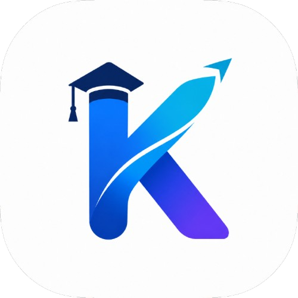

<p align="center">
  
</p>

<h1 align="center">Kalivergo</h1>

<p align="center">
  <strong>Workspace digital untuk mengelola organisasi, kelas, dan proyek dalam satu ekosistem.</strong>
</p>

<p align="center">
  <a href="DOCUMENTATION.MD">Dokumentasi</a> ·
  <a href="dataset/platform/privacy.md">Privasi</a> ·
  <a href="dataset/platform/terms.md">Syarat dan Ketentuan</a>
</p>

---

## Tentang Kalivergo

Kalivergo adalah platform manajemen berbasis web untuk membantu organisasi, universitas, program studi, dan kelas bekerja dengan lebih terarah. Platform ini menyatukan informasi, anggota, tugas, jadwal, seminar, portofolio, proyek, keuangan, dan audit dalam satu ruang kerja multi-tenant.

Kalivergo dibangun untuk mengurangi pekerjaan administratif yang terpecah-pecah, memperjelas tanggung jawab, dan membuat setiap aktivitas memiliki konteks yang mudah ditelusuri.

## Filosofi Perusahaan

### Terarah dalam bekerja

Setiap pekerjaan perlu memiliki tujuan, pemilik, tenggat, dan konteks yang jelas. Kalivergo membantu tim bergerak dari rencana menuju eksekusi tanpa kehilangan arah.

### Terhubung dalam satu ekosistem

Informasi, anggota, aktivitas, dan keputusan seharusnya tidak hidup di tempat yang terpisah. Kami merancang pengalaman kerja yang menghubungkan seluruh siklus kegiatan dalam satu platform.

### Tumbuh dengan fondasi yang kuat

Kami percaya sistem yang baik harus mampu berkembang bersama penggunanya. Karena itu, Kalivergo dibangun dengan arsitektur modular, pemisahan tenant, kontrol akses berlapis, dan ruang untuk integrasi baru.

### Bertanggung jawab terhadap data

Kepercayaan dibangun melalui perlindungan data dan akses yang tepat. Privasi, keamanan, auditabilitas, dan penggunaan teknologi yang bertanggung jawab menjadi bagian dari cara kami membangun produk.

### Teknologi yang terasa manusiawi

Teknologi hadir untuk membuat pekerjaan lebih ringan, bukan lebih rumit. Setiap fitur diarahkan untuk membantu pengguna memahami situasi, mengambil tindakan, dan berkolaborasi dengan lebih tenang.

## Modul Utama

- **Dashboard dan beranda** untuk melihat ringkasan aktivitas dan metrik.
- **Manajemen anggota dan peran** dengan akses yang disesuaikan berdasarkan role dan tenant.
- **CMS** untuk mengelola informasi, kategori, tugas, jadwal, seminar, dan aktivitas organisasi.
- **Portofolio dan proyek** untuk menyimpan serta menampilkan karya dan progres kerja.
- **Keuangan** untuk mencatat dan meninjau transaksi.
- **AI Assistant** untuk membantu menemukan informasi dan menjawab pertanyaan terkait platform.
- **Audit dan keamanan** untuk menelusuri aktivitas penting dan menjaga kontrol akses.
- **Tema terang dan gelap** dengan pengalaman yang responsif di berbagai perangkat.

## Cara Memulai

Prasyarat dan langkah instalasi lengkap tersedia di [DOCUMENTATION.MD](DOCUMENTATION.MD#7-konfigurasi-dan-menjalankan-aplikasi).

```bash
npm install
npm run dev
```

Untuk memahami struktur aplikasi, arsitektur, alur autentikasi, fitur, database, pengujian, dan batasan sistem, baca [dokumentasi teknis lengkap](DOCUMENTATION.MD).

## Struktur Singkat

```text
src/          Aplikasi, komponen, feature, service, server, dan utilitas
prisma/       Schema database dan seed
public/       Asset statis, termasuk logo perusahaan
 dataset/      Konten bantuan dan pengetahuan internal
 tests/        Contract, security, dan unit test
```

## Dokumentasi dan Kebijakan

- [Dokumentasi teknis](DOCUMENTATION.MD)
- [Panduan penggunaan dashboard](dataset/page/dashboard/how-to-use.md)
- [Panduan penggunaan home](dataset/page/home/how-to-use.md)
- [Privacy Policy](dataset/platform/privacy.md)
- [Terms of Service](dataset/platform/terms.md)
- [Audit keamanan](SECURITY_AUDIT.md)
- [Audit kualitas kode](CODE_QUALITY_AUDIT.md)

## Status Proyek

Kalivergo dikembangkan sebagai platform internal dan proprietary. Detail implementasi dapat berubah mengikuti perkembangan produk dan branch pengembangan. Gunakan `DOCUMENTATION.MD` sebagai sumber rujukan teknis utama.

## Lisensi

**Proprietary & Confidential**

Hak Cipta © 2026 Kalivergo. Semua hak dilindungi undang-undang. Penggunaan, penyalinan, distribusi, modifikasi, dan reverse engineering tanpa izin tertulis tidak diperbolehkan.
